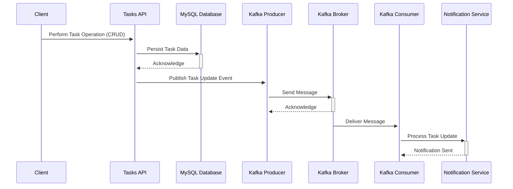

# Tasks API

## Description

This app helps track maintenance work done during the day and is made for two types of users: Managers and Technicians. Technicians can do tasks and only look at, add, or change the tasks they did. Each task includes a detailed description (up to 2500 characters) and the date it was done. 

Managers can see all the tasks done by technicians, remove any tasks, and get notified when a task is completed. This way, managers always know what maintenance work is being done.

## Architecture Overview 

- Client: This could be a web or mobile application that interacts with the Tasks API to create, retrieve, update, or delete tasks.

- Tasks API: This is the core service that processes client requests. It handles business logic for task operations and interacts with the MySQL database to persist task data. When a task is updated, it also sends a message to a Kafka topic using a Kafka producer.

- MySQL Database: Stores task data persistently, allowing for operations such as adding new tasks, retrieving tasks, updating existing tasks, and deleting tasks.

- Kafka Producer: Part of the Tasks API, it sends messages to a Kafka topic whenever a significant event occurs, such as a task update. These messages can contain information about the event, such as the task ID and the nature of the update.

- Kafka Broker: Receives messages from producers and stores them until they are consumed. It ensures messages are delivered to consumers in the order they were sent and handles message retention, replication, and partitioning.

- Kafka Consumer: Subscribes to the Kafka topic to receive messages about task updates. This could be a separate service responsible for processing these messages, such as sending notifications to users or other systems about the updates.

- Notification Service: Receives information from the Kafka Consumer about task updates and performs actions such as sending email notifications, SMS messages, or push notifications to notify users or other systems of the changes.

### How can I run this project?

First you need to build the images from the API and kafka consumer, run `make build-containers`.

After that you can run `make start` that will initiate the following containers:

- [APP] Rest API for tasks & users;
- [APP] Kafka consumer for the `managerNotification` topic;
- [Infrastructure] MySQL database that stores users and tasks;
- [Infrastructure] Zookeeper Kafka metadata manager;
- [Infrastructure] The Kafka;
- [Infrastructure] [Control Center](http://localhost:9021) to get an interface to help manage the Kafka's traffic.

Image sizes for the apps should be around this:

| Image name                       | Tag    | Size   |
|----------------------------------|--------|--------|
| cristovaoolegario/tasks-consumer | latest | 15.7MB |
| cristovaoolegario/tasks-api      | latest | 32.5MB |

You can check this locally after you build the containers by running ` docker images -a | grep cristovaoolegario/tasks`
