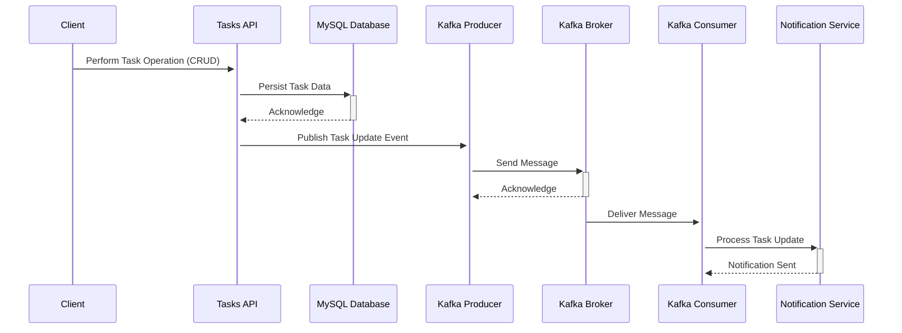

[](https://github.com/cristovaoolegario/tasks-api/actions/workflows/go.yml)

[](https://goreportcard.com/report/github.com/cristovaoolegario/tasks-api)

# Tasks API

This app helps track maintenance work done during the day and is made for two types of users: Managers and Technicians. Technicians can do tasks and only look at, add, or change the tasks they did. Each task includes a detailed description (up to 2500 characters) and the date it was done. 

Managers can see all the tasks done by technicians, remove any tasks, and get notified when a task is completed. This way, managers always know what maintenance work is being done.

## Table of Contents
- [Features](#features)
- [Architecture Overview](#architecture-overview)
- [Getting Started](#getting-started)
    - [Prerequisites](#prerequisites)
    - [Installation](#installation)
- [Usage](#usage)
    - [Local Development](#local-development)
    - [Docker Compose](#docker-compose)
    - [Kubernetes Deployment](#kubernetes-deployment)
- [API Endpoints](#api-endpoints)
- [Docker images](#docker-images)


## Features
- Create tasks
- Update tasks
- Delete tasks
- Retrieve tasks by ID
- Retrieve tasks by user ID
- Pagination support
- Authentication with JWT tokens

## Architecture Overview



- Client: This could be a web or mobile application that interacts with the Tasks API to create, retrieve, update, or delete tasks.

- Tasks API: This is the core service that processes client requests. It handles business logic for task operations and interacts with the MySQL database to persist task data. When a task is updated, it also sends a message to a Kafka topic using a Kafka producer.

- MySQL Database: Stores task data persistently, allowing for operations such as adding new tasks, retrieving tasks, updating existing tasks, and deleting tasks.

- Kafka Producer: Part of the Tasks API, it sends messages to a Kafka topic whenever a significant event occurs, such as a task update. These messages can contain information about the event, such as the task ID and the nature of the update.

- Kafka Broker: Receives messages from producers and stores them until they are consumed. It ensures messages are delivered to consumers in the order they were sent and handles message retention, replication, and partitioning.

- Kafka Consumer: Subscribes to the Kafka topic to receive messages about task updates. This could be a separate service responsible for processing these messages, such as sending notifications to users or other systems about the updates.

- Notification Service: Receives information from the Kafka Consumer about task updates and performs actions such as sending email notifications, SMS messages, or push notifications to notify users or other systems of the changes.


## Getting started

### Prerequisites
- Go (1.16 or later)
- MySQL (5.7 or later)
- Kafka (optional, for event notifications)

## Installation

To install the Tasks API, follow these steps:

1. Clone this repository to your local machine:
```bash
  git clone https://github.com/cristovaoolegario/tasks-api.git
```

2. Install dependencies
```bash
  go mod tidy
```

3. Set up the required environment variables. You can use a .env file or specify them directly. There's and .env.example file that you can use as starting point.


## Usage

### Local development

1. Build the application:
```bash
  go build -o tasks-api cmd/api/rest/main.go
```
2. Run the application:
```bash
  ./tasks-api
```
The API can be accessed at http://localhost:3000. You can use tools like Postman or cURL to interact with the API.

### Docker compose

To execute the Tasks API using docker-compose, follow these steps:

1. Build the images from the API and kafka consumer, run :
```bash 
  make build-containers
```

2. To initiate all containers run:
```bash
  make start 
```

3. This will start the following containers: 

- [APP] Rest API for tasks & users;
- [APP] Kafka consumer for the `managerNotification` topic;
- [Infrastructure] MySQL database that stores users and tasks;
- [Infrastructure] Zookeeper Kafka metadata manager;
- [Infrastructure] The Kafka;
- [Infrastructure] [Control Center](http://localhost:9021) to get an interface to help manage the Kafka's traffic.

4. To shut down the containers just execute:
```bash
  docker-compose down
```

### Kubernetes Deployment
To deploy the Tasks API using Kubernetes, follow these steps:

1. Ensure you have a Kubernetes cluster set up and configured. You can use Minikube for local development or a cloud provider like Google Kubernetes Engine (GKE) or Amazon Elastic Kubernetes Service (EKS).
2. Modify the Kubernetes deployment files inside the manifests folder to match your configs.
3. Apply the Kubernetes manifest files to your cluster:
```bash
  make deploy
```
4. Verify that the deployment is running:
```bash
  kubectl get pods
```
5. The API should now be accessible within your Kubernetes cluster.

## API endpoints

- POST /login: User login
- POST /api/users: Create a new user
- GET /api/users/:username: Get a user by username
- GET /api/tasks: Get all tasks
- POST /api/tasks: Create a new task
- GET /api/tasks/:id: Get a task by ID
- PUT /api/tasks/:id: Update a task
- DELETE /api/tasks/:id: Delete a task

For more detailed API documentation, visit the [Swagger UI](http://localhost:3000/swagger/index.html).

## Docker images

Image sizes for the apps should be around this:

| Image name                               | Tag    | Size   |
|------------------------------------------|--------|--------|
| ghcr.io/cristovaoolegario/tasks-consumer | 1.0.0  | 16.6MB |
| ghcr.io/cristovaoolegario/tasks-api      | 1.0.0  | 32.5MB |
| ghcr.io/cristovaoolegario/tasks-consumer | latest | 16.6MB |
| ghcr.io/cristovaoolegario/tasks-api      | latest | 43.1MB |
| cristovaoolegario/tasks-consumer         | latest | 16.6MB |
| cristovaoolegario/tasks-api              | latest | 43.1MB |

You can check this locally after you build the containers by running ` docker images -a | grep cristovaoolegario/tasks`
